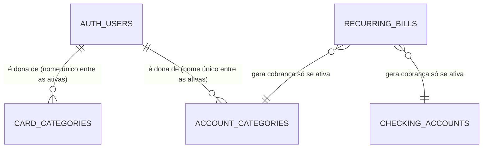

# Database Change Proposal: category-and-bill-integrity

## Ficha do dado (para o dono)

- **O que vamos guardar e por quê:** nada novo. Mudam três regras das categorias e das contas recorrentes que já existem.
  1. Depois de arquivar uma categoria, a pessoa pode criar outra com o mesmo nome. Duas categorias **ativas** com o mesmo nome continuam proibidas.
  2. Só "Pagamento de fatura" é categoria do sistema. Ela não pode ser renomeada nem arquivada, e ninguém cria outra categoria do sistema. As demais categorias iniciais viram categorias comuns, que a pessoa pode renomear e arquivar.
  3. Uma conta recorrente ligada a uma conta ou categoria arquivada deixa de gerar novas cobranças do mês, porque elas não poderiam ser pagas.
- **Quem pode ver:** só a própria pessoa logada. Nada muda.
- **Quem pode criar, mudar ou apagar:** a própria pessoa, exceto a categoria do sistema, que só o próprio sistema altera ao pagar uma fatura.
- **Dados pessoais:** pessoais (nomes de categorias), já classificados. Nenhum dado novo.
- **Por que precisamos desses dados pessoais (finalidade):** organizar as finanças da própria pessoa.
- **Por quanto tempo guardamos:** enquanto a conta existir; apagados junto com a conta.
- **O que acontece quando a pessoa pede para apagar a conta:** tudo é apagado junto, como já aprovado.
- **O que se perde se esta mudança der errado:** nenhum dado é apagado. No pior caso, criar uma categoria ou pagar uma fatura falharia até uma correção.

### Cenários de acesso

- ✅ Uma pessoa logada cria uma categoria com o nome de uma categoria que ela arquivou.
- ❌ Uma pessoa logada **não** cria duas categorias ativas com o mesmo nome.
- ❌ Uma pessoa logada **não** cria, renomeia, arquiva nem promove uma categoria do sistema.
- ❌ Uma conta recorrente ligada a uma conta ou categoria arquivada **não** gera cobrança nova.

### Desenho

### Aprovação

- Aprovado por (nome e data): Elton Carvalho, 2026-09-15 (na conversa com o agente)
- Aprovação de mudança que apaga ou reescreve dados (nome e data):

## Intent

- User or business outcome: archived names are reusable, the invoice-payment system category is protected at the database boundary, and recurring bills never create unpayable occurrences.
- Entities created or changed: `account_categories` and `card_categories` uniqueness; `account_categories` insert/update policies; `private.ensure_starter_categories`, `public.pay_card_statement`, `public.ensure_recurring_bill_occurrences`.
- Explicit non-goals: chargeback, installment, and statement rules; account deletion UI; remote execution.

## Model and duplication check

- Data-dictionary entries consulted: `account_categories`, `card_categories`, `recurring_bills`, `recurring_bill_occurrences`.
- Authoritative source for each fact: unchanged. The system category is identified by `is_system`, not by its label.
- Similar existing tables, fields, or views and why this is not duplicate: not applicable.
- Derived or cached data and refresh/consistency rule: not applicable.

## Integrity and lifecycle

- Primary key and identity strategy: unchanged.
- Relationships and cardinality: unchanged.
- Required fields, unique rules, checks, defaults, and delete behavior: `unique (user_id, name)` becomes a unique index on `(user_id, name) where archived_at is null` for both category tables. At most one active system account category per user (`unique (user_id) where is_system and archived_at is null`).
- Timestamps, retention, deletion, or audit requirement: unchanged.
- Account deletion: unchanged (cascade).
- Source fix: the unpublished migration `20260914215729_provision_starter_categories.sql` flagged every starter account category as system, contradicting the approved proposal (`2026-09-14-account-overview-data.md`: only "Pagamento de fatura" is system). It is corrected in place because no migration exists on `main` or in production; no data rewrite migration is needed.

## Personal data (LGPD)

- Column classification: unchanged.
- Legal basis or purpose for personal and sensitive columns: unchanged.
- Retention and deletion rule: unchanged.
- Seed data is fictitious only: no seed file.

## Access and queries

- Tenant or ownership boundary: `user_id = auth.uid()`.
- Public API exposure, grants, RLS policies, Storage, RPC, view, function, or trigger impact: account category insert policy adds `not is_system`; update policy `using` adds `not is_system` and `with check` adds `not is_system`. `pay_card_statement` (security definer) finds the system category by `is_system` and reactivates or creates it. `ensure_recurring_bill_occurrences` joins active account and category.
- Exceptions to the Harness guards: unchanged (existing security definer exceptions keep their comments).
- Expected read, write, join, filter, and sort paths: category name lookups use the new partial unique indexes; bill generation joins by primary key.
- Proposed indexes and read/write trade-off: the partial unique indexes replace the full unique constraints one-for-one.

## Migration and release plan

- Migration shape: constraint-to-partial-index replacement, policy replacement with the same names, function replacement. No row is deleted or rewritten.
- Compatibility with the prior application version: compatible; the UI already hides actions on the system category.
- Lock, volume, and backfill risk: small MVP tables; index build under a short lock.
- Rollback or forward-fix plan: forward migration.
- Test plan: `supabase/tests/category_integrity_test.sql` (one assertion per scenario, red first), reset, lint, pgTAP, Harness guards, advisors, full verify.
