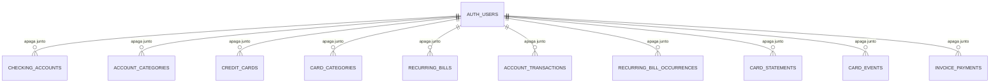

# Database Change Proposal: harness-040-database-adequation

## Ficha do dado (para o dono)

- **O que vamos guardar e por quê:** nada novo. Os dados continuam os mesmos (contas, categorias, cartões, faturas, lançamentos e contas recorrentes). A mudança documenta cada tabela e cada coluna dentro do banco e muda o que acontece quando alguém apaga a conta.
- **Quem pode ver:** só a própria pessoa logada vê os dados dela. Nada muda.
- **Quem pode criar, mudar ou apagar:** só a própria pessoa logada, como hoje. Nada muda.
- **Dados pessoais:** pessoais. Nomes de contas, bancos e cartões, descrições de lançamentos, valores, limites e datas de lançamentos mostram a vida financeira de uma pessoa identificável. Nenhum dado sensível (saúde, religião, biometria etc.).
- **Por que precisamos desses dados pessoais (finalidade):** mostrar saldos, faturas e contas a pagar da própria pessoa. Não usamos para mais nada nem enviamos a terceiros.
- **Por quanto tempo guardamos:** enquanto a conta existir. Lançamentos e faturas ficam como histórico financeiro e não são apagados um a um.
- **O que acontece quando a pessoa pede para apagar a conta:** **todos** os dados financeiros dela são apagados junto, de vez. Hoje o banco impede apagar a conta enquanto existir qualquer lançamento. Decisão do dono em 2026-09-15: apagar tudo junto.
- **O que se perde se esta mudança der errado:** no pior caso, apagar a conta de uma pessoa falharia (como já acontece hoje). Nenhum dado existente é apagado ou alterado pela migration: ela só troca a regra de exclusão e adiciona descrições.

### Cenários de acesso

- ✅ Quando uma pessoa apaga a conta, todas as contas, categorias, cartões, faturas, lançamentos e contas recorrentes dela deixam de existir.
- ❌ Quando uma pessoa apaga a conta, os dados de outra pessoa **não** são apagados.
- ❌ Uma pessoa sem login **não** executa nenhuma função financeira.

### Desenho

### Aprovação

- Aprovado por (nome e data): Elton Carvalho, 2026-09-15 (na conversa com o agente)
- Aprovação de mudança que apaga ou reescreve dados (nome e data):

## Intent

- User or business outcome: the schema satisfies the Harness 0.4.0 database guards, and account deletion removes every owned financial record (LGPD erasure).
- Entities created or changed: comments on the ten `public` finance tables and all their columns; `user_id` foreign keys to `auth.users`; exception comments on eight `public` security definer command functions.
- Explicit non-goals: new tables, columns, grants, policies, account-deletion UI, remote execution.

## Model and duplication check

- Data-dictionary entries consulted: all ten finance entities; no new concept.
- Authoritative source for each fact: unchanged.
- Similar existing tables, fields, or views and why this is not duplicate: not applicable.
- Derived or cached data and refresh/consistency rule: unchanged; balances and statement totals remain derived.

## Integrity and lifecycle

- Primary key and identity strategy: unchanged.
- Relationships and cardinality: unchanged.
- Required fields, unique rules, checks, defaults, and delete behavior: `user_id → auth.users` changes from `on delete restrict` to `on delete cascade` on all ten tables. Owner-scoped composite foreign keys between finance tables change from `restrict` to `no action` only if the cascade test proves `restrict` aborts a whole-user cascade; direct row deletes remain denied by grants/RLS and by the end-of-statement `no action` check.
- Timestamps, retention, deletion, or audit requirement: history is retained for the account lifetime and erased with the account.
- Account deletion: every foreign key to `auth.users` uses `on delete cascade`.

## Personal data (LGPD)

- Column classification:
  - `pii:none`: `id`, owner-scoped links to other finance rows, `created_at`, `updated_at`, `archived_at`, `paused_at`, `paid_at`, enum/status/type fields, `is_system`, card configuration rates (`points_per_usd`, `brl_per_usd` and their snapshots).
  - `pii:personal`: `user_id`; account, card, and category names; `institution`, `issuer`; transaction, bill, and event `description`; money amounts and limits; `opening_balance_cents`; transaction/event/payment dates, due and closing days, statement months and dates, occurrence months.
- Legal basis or purpose for personal columns: execution of the service requested by the person (showing their own finances).
- Retention and deletion rule: kept while the account exists; erased by cascade on account deletion.
- Seed data is fictitious only: no seed file exists.

## Access and queries

- Tenant or ownership boundary: `user_id = auth.uid()`, unchanged.
- Public API exposure, grants, RLS policies, Storage, RPC, view, function, or trigger impact: no grant or policy change. Comments only on functions.
- Exceptions to the Harness guards: `harness:allow-security-definer` on `create_card_purchase`, `create_installment_purchase`, `create_chargeback`, `ensure_recurring_bill_occurrences`, `mark_recurring_bill_paid`, `skip_recurring_bill_occurrence`, `close_due_card_statements`, `pay_card_statement`. Reason: each is an atomic multi-table financial command exposed as RPC to `authenticated` only (anon revoked), derives the owner from `auth.uid()`, validates ownership of every referenced row, and uses `search_path = ''`. Moving them to `private` behind invoker wrappers would change the RPC interface without reducing privilege; revisit if a command needs broader writes.
- Expected read, write, join, filter, and sort paths: unchanged.
- Proposed indexes and read/write trade-off: none; cascade deletes use the existing `user_id` leading indexes (verified in the DBA review).

## Migration and release plan

- Migration shape: constraint replacement plus comments. The guard may classify dropping and re-adding constraints as 🟠 (compatibility); no row is deleted or rewritten.
- Compatibility with the prior application version: compatible; the application never deletes users.
- Lock, volume, and backfill risk: `alter table … add constraint` validates existing rows under a short lock; tables are small in the MVP.
- Rollback or forward-fix plan: forward migration restoring `restrict` if erasure must be revisited.
- Test plan: new pgTAP scenario per access line above (red first), `pnpm db:reset`, `pnpm db:lint`, `pnpm db:test`, Harness guards, advisors, full `npm run harness -- verify`.
