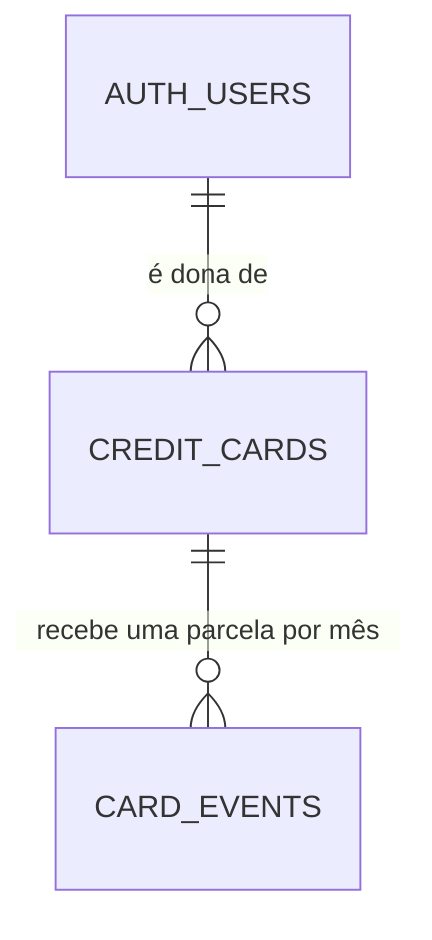

# Database Change Proposal: lint-clean-installment-purchase

## Ficha do dado (para o dono)

- **O que vamos guardar e por quê:** nada novo, e nada muda de comportamento. A função que lança uma compra parcelada no cartão é reescrita igualzinha, só tirando duas imperfeições de escrita que o verificador de qualidade do banco aponta como aviso: uma lista vazia sem tipo declarado e uma variável sobrando que nunca é lida.
- **Quem pode ver:** ninguém muda. A função continua sendo executada só por pessoa logada, sobre os próprios cartões.
- **Quem pode criar, mudar ou apagar:** igual a hoje. As permissões da função são preservadas.
- **Dados pessoais:** nenhum dado novo, nenhuma classificação muda.
- **Por que precisamos desses dados pessoais (finalidade):** não se aplica.
- **Por quanto tempo guardamos:** não se aplica.
- **O que acontece quando a pessoa pede para apagar a conta:** nada muda.
- **O que se perde se esta mudança der errado:** nenhum dado é apagado nem alterado. No pior caso, lançar uma compra parcelada falharia até uma correção.
- **Por que isso não foi corrigido no arquivo original:** a migration `20260913214357_initial-finance.sql` já está publicada. Migration publicada nunca muda — a correção precisa vir numa migration nova.

### Cenários de acesso

- ✅ Uma pessoa logada lança uma compra parcelada no próprio cartão ativo e recebe um evento por parcela.
- ❌ Uma pessoa não logada **não** executa a função.
- ❌ Uma pessoa logada **não** lança parcelas no cartão de outra pessoa.

### Desenho

### Aprovação

- Aprovado por (nome e data): Elton Carvalho, 2026-09-15 (na conversa com o agente)
- Aprovação de mudança que apaga ou reescreve dados (nome e data): não se aplica (🟢 só adiciona)

## Intent

- User or business outcome: `supabase db lint --fail-on warning` passes on a clean database built from migrations, so the Database gate can stay green without editing a published migration.
- Entities created or changed: `public.create_installment_purchase` body only.
- Explicit non-goals: signature, behaviour, privileges, comments, and every other function.

## Model and duplication check

- Data-dictionary entries consulted: `credit_cards`, `card_events`, `card_categories`, `card_statements`.
- Authoritative source for each fact: unchanged.
- Similar existing tables, fields, or views and why this is not duplicate: not applicable.
- Derived or cached data and refresh/consistency rule: not applicable.

## Integrity and lifecycle

- Primary key and identity strategy: unchanged.
- Relationships and cardinality: unchanged.
- Required fields, unique rules, checks, defaults, and delete behavior: unchanged.
- Timestamps, retention, deletion, or audit requirement: unchanged.
- Account deletion: unchanged (cascade).

## Personal data (LGPD)

- Column classification: unchanged.
- Legal basis or purpose for personal and sensitive columns: unchanged.
- Retention and deletion rule: unchanged.
- Seed data is fictitious only: no seed file.

## Access and queries

- Tenant or ownership boundary: `auth.uid()`, checked inside the function exactly as before.
- Public API exposure, grants, RLS policies, Storage, RPC, view, function, or trigger impact: `create or replace function` preserves the existing grants (`authenticated` only, revoked from `public` and `anon`) and the `harness:allow-security-definer` comment. No grant, revoke, or comment statement is reissued.
- Exceptions to the Harness guards: unchanged; the security definer exception comment from `20260915222036_harness_040_database_adequation.sql` still applies.
- Expected read, write, join, filter, and sort paths: unchanged.
- Proposed indexes and read/write trade-off: none.

## Migration and release plan

- Migration shape: one `create or replace function`. No DDL on tables, no row touched.
- Compatibility with the prior application version: fully compatible; the signature and return type are identical.
- Lock, volume, and backfill risk: none beyond a momentary lock on the function definition.
- Rollback or forward-fix plan: forward migration; the previous body is recoverable from `20260913214357_initial-finance.sql`.
- Test plan: `pnpm db:reset`, `pnpm db:lint` (red first: three warnings on `public.create_installment_purchase`), `pnpm db:test`, Harness guards, advisors, full verify.
