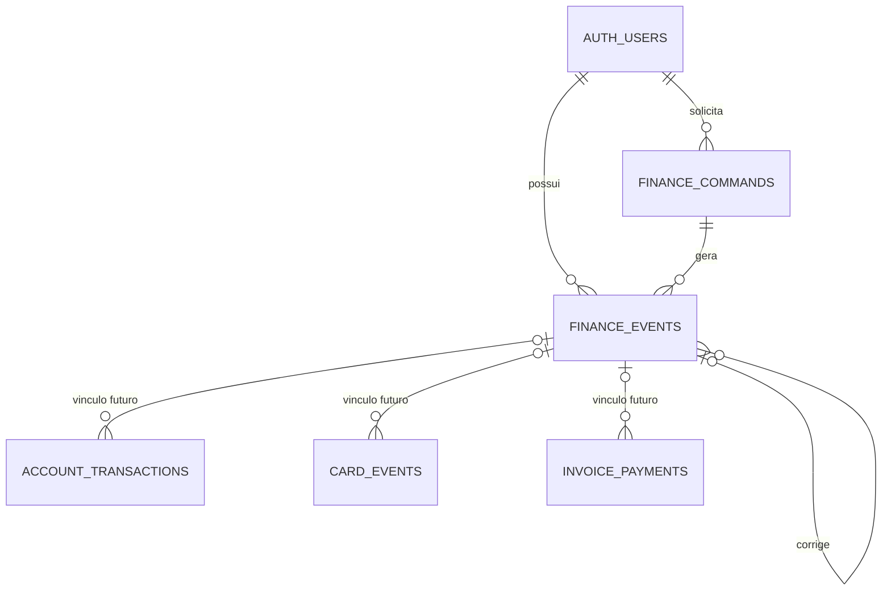

# Database Change Proposal: finance-event-foundation (draft; no migration yet)

## Ficha do dado (para o dono)

- **O que vamos guardar e por quê:** um identificador para cada movimentação financeira futura, seu tipo, data, estado (pendente ou confirmada) e o vínculo com uma eventual correção; também um registro de cada comando confirmado para impedir que uma tentativa repetida crie lançamentos em dobro. Esta primeira etapa criaria apenas duas estruturas vazias. Os lançamentos atuais continuariam onde estão, sem conversão nesta etapa.
- **Quem pode ver:** cada pessoa logada poderá ver somente os próprios eventos de movimentação. O registro técnico usado para evitar comandos duplicados não será uma lista aberta no aplicativo; a pessoa receberá apenas a resposta da própria operação.
- **Quem pode criar, mudar ou apagar:** somente operações controladas pelo banco, após confirmar quem está logado e a quem pertencem os dados. A pessoa poderá solicitar ações pelo aplicativo, mas não poderá editar diretamente esses registros. Eventos confirmados não serão apagados ou reescritos; uma correção futura criará um registro ligado ao original.
- **Dados pessoais:** dados pessoais financeiros. Datas, estados, vínculos e identificadores associados à pessoa revelam sua atividade financeira. Esta etapa não pede dados sensíveis como saúde, religião ou biometria, embora descrições livres existentes possam conter informação pessoal fornecida pela própria pessoa.
- **Por que precisamos desses dados pessoais (finalidade):** mostrar histórico verificável, evitar movimentações duplicadas e permitir a correção auditável de registros financeiros.
- **Por quanto tempo guardamos:** enquanto a conta da pessoa existir. O histórico de movimentações confirmadas e seus vínculos de correção precisam permanecer juntos para que o saldo possa ser conferido.
- **O que acontece quando a pessoa pede para apagar a conta:** os registros desta proposta são apagados junto com os demais dados financeiros dela, conforme a regra já aprovada para exclusão da conta.
- **O que se perde se esta mudança der errado:** nesta primeira etapa, nenhum lançamento ou saldo atual deve mudar. O risco principal seria uma permissão incorreta expor a existência de movimentações ou permitir registros duplicados quando os comandos futuros forem ativados; testes de acesso, repetição e concorrência devem impedir essa liberação.

### Cenários de acesso

- ✅ Uma pessoa logada vê somente os próprios eventos financeiros.
- ❌ Uma pessoa logada **não** vê eventos de outra pessoa, mesmo conhecendo o identificador.
- ❌ Uma pessoa sem login **não** vê eventos nem registros de comandos.
- ❌ Uma pessoa logada **não** cria, muda ou apaga eventos e registros de comandos por acesso direto.
- ✅ Apagar a conta da pessoa apaga também seus eventos e registros de comandos, sem apagar os de outras pessoas.

### Desenho

### Aprovação

- Aprovado por (nome e data):
- Aprovação de mudança que apaga ou reescreve dados (nome e data):

A segunda linha não é necessária para esta etapa, que só adiciona estruturas vazias. Vincular e converter lançamentos já existentes exigirá outra proposta, confirmação de um backup recente e aprovação específica.

## Intent

- User or business outcome: establish owner-scoped event identity and idempotent command records for FR-039/FR-060 and NFR-003 before implementing pending records or posted corrections.
- Entities created or changed: new `finance_events` and `finance_commands`; no existing table or row is changed in this stage.
- Explicit non-goals: pending transaction UI, balance changes, old-row backfill, transfer/payment commands, attachments, remote execution, or destructive migration.

## Model and duplication check

- Data-dictionary entries consulted: `account_transactions`, `card_events`, and `invoice_payments` own typed money details. `finance_events` adds shared identity/lifecycle/correction links, not a second amount or description. `finance_commands` stores replay identity and a minimal versioned result, not a second ledger.
- Authoritative source for each fact: existing typed rows remain authoritative for posted monetary effects; the event registry becomes authoritative for lifecycle and correction links only when the separate linking/backfill stage has passed parity tests.
- Similar existing tables, fields, or views and why this is not duplicate: existing row IDs identify one subtype; they cannot link account, card, and payment corrections under one owner-consistent graph. Existing RPCs have no uniform idempotency record.
- Derived or cached data and refresh/consistency rule: no balance or statement total is stored in the new tables. Command results are immutable replay records for the same request identity.

## Integrity and lifecycle

- Primary key and identity strategy: UUID IDs; the client generates one `idempotency_key` UUID per confirmed logical command and reuses it only for a retry of that same request. Commands have one owner-scoped unique `(user_id, command_name, idempotency_key)`; event links use owner-consistent composite keys.
- Relationships and cardinality: one user owns many events and commands; one command may create many events. Separate `supersedes_event_id` and `reverses_event_id` links identify each earlier owned event corrected or compensated. Future typed detail links are deferred to a separate compatible migration.
- Required fields, unique rules, checks, defaults, and delete behavior: require owner, kind, date, lifecycle, command name/key/request fingerprint, terminal persisted status, and versioned JSON result with the common `{ commandId, eventIds, aggregateIds }` envelope. A retry with the same key and fingerprint returns the saved result; the same key with a different fingerprint fails. Constrain known lifecycle and correction roles; reject self/cross-owner correction links; cascade on user deletion. Exact allowed event kinds must be checked against the formal epic stories before migration.
- Timestamps, retention, deletion, or audit requirement: each correction records actor, reason, and audit instant; creation and correction times use audit timestamps. Posted events and completed command results remain immutable during account lifetime; account deletion cascades.
- Account deletion: both new owner foreign keys use `on delete cascade`; correction and command links must not block the whole-user deletion test.

## Personal data (LGPD)

- Column classification plan: `pii:personal` for `user_id`, actor ID, financial effective date, event/command creation and correction timestamps, correction reason, and request/result data or fingerprints linked to a person's finances; `pii:none` for surrogate IDs and constrained type/status labels. Recheck each final column before migration and add the required column comments.
- Legal basis or purpose for personal columns: provide the private finance history and safe retry requested by the person; no analytics or sharing.
- Retention and deletion rule: account lifetime, then cascading deletion; no production data in local tests or seed.
- Seed data is fictitious only: required.

## Access and queries

- Tenant or ownership boundary: authenticated `auth.uid()` equals `user_id`; correction and command references also match that owner.
- Public API exposure, grants, RLS policies, Storage, RPC, view, function, or trigger impact: `finance_events` is readable by its authenticated owner with RLS; direct insert/update/delete is revoked. `finance_commands` has RLS but no direct client-table access; future authenticated RPCs validate ownership, fingerprint, latest financial state, and atomicity. No Storage or Edge Function change in this stage.
- Exceptions to the Harness guards: none planned for the two tables. Future command functions require separate reviewed `security definer` or private-schema design and an access-matrix entry.
- Expected read, write, join, filter, and sort paths: owner plus effective date and stable event ID for history; owner plus command name/idempotency key for retry; owner plus correction parent for audit traversal.
- Proposed indexes and read/write trade-off: owner/date/ID history index, owner-scoped command unique index, and correction-parent index if query-plan evidence supports it. Avoid redundant owner-only indexes when a leading owner composite serves the same path.

## Migration and release plan

- Migration shape: additive empty foundation only; the older app remains compatible and continues using current tables/RPCs.
- Compatibility with the prior application version (expand first, contract in a later PR): no old read or write path changes in this stage; future linking/backfill and constraint enforcement are separate proposals and migrations.
- Lock, volume, and backfill risk: new empty tables have low lock/volume risk; there is no backfill in this proposal.
- Rollback or forward-fix plan: before activation, a forward migration may adjust the empty model; after activation, repair through additive reviewed migrations rather than deleting event history.
- Test plan: first add one pgTAP allow/deny test for every access scenario in this card, including account deletion; then add dictionary/matrix entries, migration, guards, local reset, lint, advisors, type generation, and full Harness verify. Same-key retry, changed-fingerprint rejection, and concurrent command serialization belong to the later command proposal and its own red tests.
