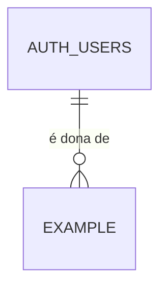

# Database Change Proposal: <short-slug>

<!-- The "Ficha do dado" is written for the owner in owner_locale, in plain language, with no SQL.
`npm run harness -- verify` and the Database gate read the two approval lines below: leave them empty
until the owner has read the card and answered in the conversation. The agent never fills them on its own. -->

## Ficha do dado (para o dono)

- **O que vamos guardar e por quê:**
- **Quem pode ver:**
- **Quem pode criar, mudar ou apagar:**
- **Dados pessoais:** nenhum / pessoais (ex.: nome, e-mail, telefone) / sensíveis (saúde, religião, biometria, origem racial, vida sexual, opinião política, dados de crianças)
- **Por que precisamos desses dados pessoais (finalidade):**
- **Por quanto tempo guardamos:**
- **O que acontece quando a pessoa pede para apagar a conta:**
- **O que se perde se esta mudança der errado:**

### Cenários de acesso

<!-- Each scenario becomes one pgTAP allow or deny test with the same wording. -->

- ✅ Uma pessoa logada vê os próprios …
- ❌ Uma pessoa logada **não** vê os … de outra pessoa.
- ❌ Uma pessoa sem login **não** vê nenhum …

### Desenho

### Aprovação

- Aprovado por (nome e data):
- Aprovação de mudança que apaga ou reescreve dados (nome e data):

<!-- The second line is required only when the migration deletes, rewrites, renames, or changes the type
of existing data (the database guard classifies it). Before asking, tell the owner exactly what will be lost
and confirm a recent production backup exists. -->

## Intent

- User or business outcome:
- Entities created or changed:
- Explicit non-goals:

## Model and duplication check

- Data-dictionary entries consulted:
- Authoritative source for each fact:
- Similar existing tables, fields, or views and why this is not duplicate:
- Derived or cached data and refresh/consistency rule:

## Integrity and lifecycle

- Primary key and identity strategy:
- Relationships and cardinality:
- Required fields, unique rules, checks, defaults, and delete behavior:
- Timestamps, retention, deletion, or audit requirement:
- Account deletion: every foreign key to `auth.users` uses `on delete cascade` or `set null`, or documents the `harness:allow-restrict-user-delete` exception:

## Personal data (LGPD)

- Column classification (`comment on column … is 'pii:none|pii:personal|pii:sensitive <purpose>'`):
- Legal basis or purpose for personal and sensitive columns:
- Retention and deletion rule:
- Seed data is fictitious only:

## Access and queries

- Tenant or ownership boundary:
- Public API exposure, grants, RLS policies, Storage, RPC, view, function, or trigger impact:
- Exceptions to the Harness guards (`harness:allow-public`, `harness:allow-security-definer`) and why:
- Expected read, write, join, filter, and sort paths:
- Proposed indexes and read/write trade-off:

## Migration and release plan

- Migration shape: additive / backfill / rename / destructive:
- Compatibility with the prior application version (expand first, contract in a later PR):
- Lock, volume, and backfill risk:
- Rollback or forward-fix plan:
- Test plan: reset, lint, pgTAP, Harness guards, advisors, RLS allow/deny, integration, and performance evidence:
